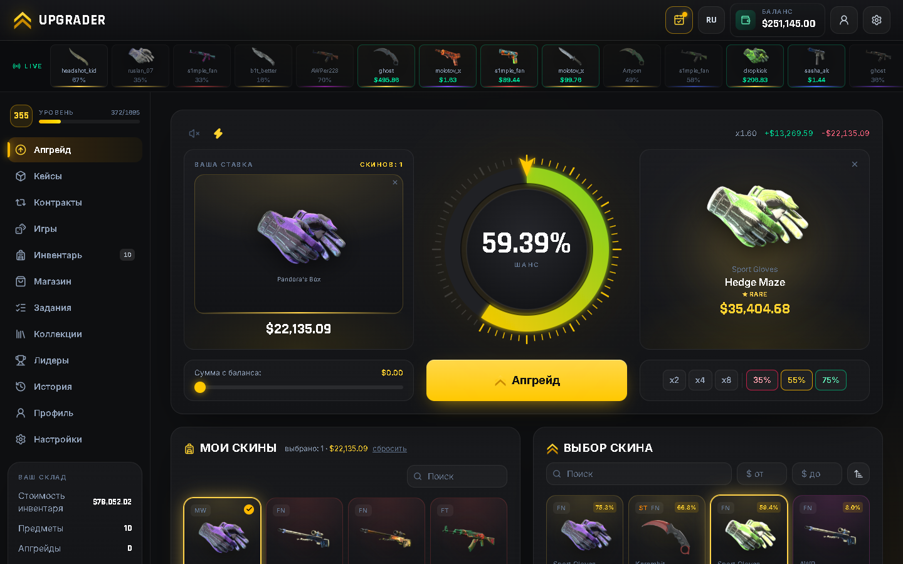
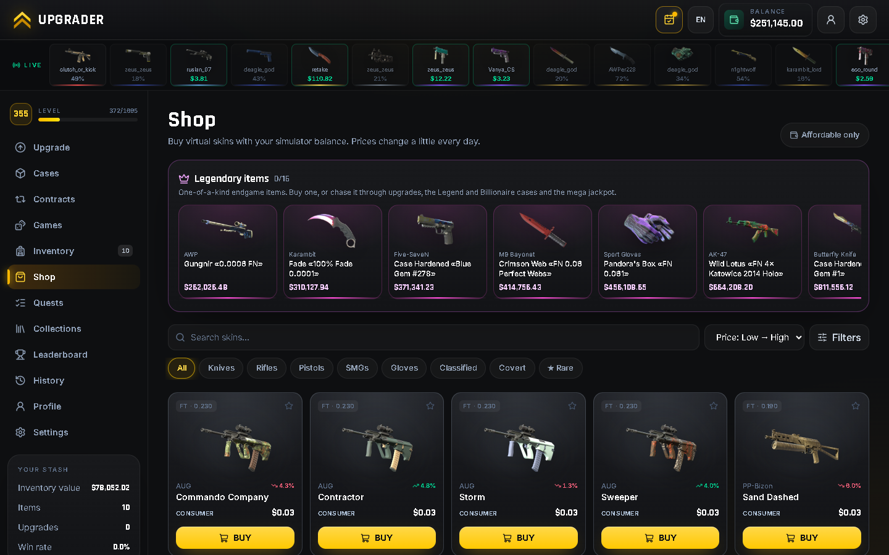
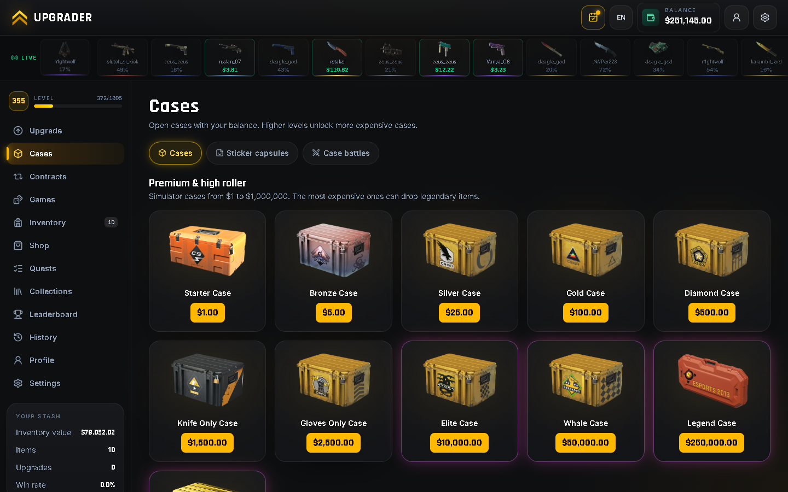
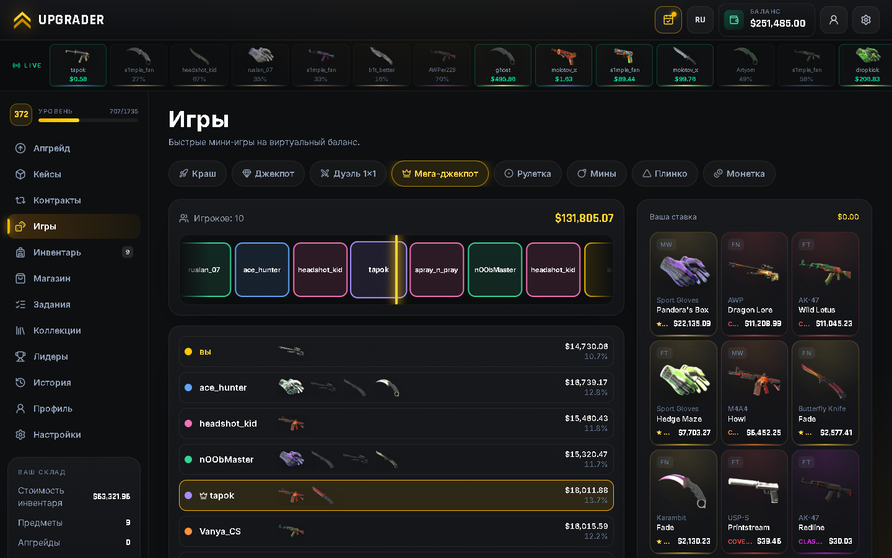
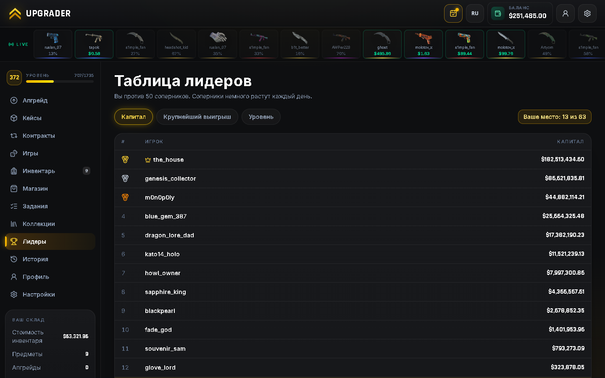

# Case Battle — CS2 Upgrader Simulator

A browser simulator of CS2 skin upgrades, cases, trade-up contracts and mini-games. All money is virtual. There are no deposits, withdrawals or Steam transactions. Progress is stored in your browser.

**▶ Play:** https://upgraader.netlify.app



## Features

- **Upgrade:** stake several skins plus balance, with x2/x4/x8 and 35/55/75% presets. A small luck bonus kicks in after a losing streak.
- **2,376 items:** every CS2 weapon skin, knife and glove finish, every Doppler and Gamma Doppler phase (Ruby, Sapphire, Black Pearl, Emerald, Phase 1–4), vanilla knives, 63 agents, 78 charms and 89 music kits, with Steam artwork. Real Skinport prices per wear (FN–BS), StatTrak™ and Souvenir, from $0.03 to $35,000.
- **Live market:** prices move every hour, every item has a 7-day price chart, and each day brings a market event (knife rally, glove boom, crash, discontinued collection…).
- **Legendary items:** 31 one-of-a-kind items from $120K to $1B, such as Karambit «Blue Gem #387», StatTrak Howl with 4× iBUYPOWER Holo, and simulator prototypes.
- **Up to 208 cases:**
  - 42 official CS2 cases with their real contents and odds (Mil-Spec 79.92% … ★ 0.26%, StatTrak 10%);
  - 150 major souvenir packages that drop Souvenir skins;
  - 13 high-roller cases from $1 to $100,000,000;
  - seasonal event cases (autumn, Halloween, winter) with themed skins, available only while the event runs.
- **Case battles** against bots, including on the most expensive cases.
- **Mini-games:**
  - Jackpot;
  - Duel 1v1;
  - Mega jackpot;
  - Crash with money or skins (up to x900);
  - Roulette;
  - Mines;
  - Towers;
  - Hi-Lo;
  - Plinko;
  - Coinflip.
- **Matches and Pick'em:** bet on simulated CS matches (16 teams, odds from ratings and form, live round-by-round scoreboard) and predict a free daily 8-team Pick'em bracket.
- **Events:** double XP on weekends, a daily deal (−15%, one purchase per day) and seasonal cases.
- **Inspect:** zoom and tilt any item, see its exact float and pattern, StatTrak™ kill counter, name tags and sticker scraping.
- **Trade-up contracts, bot trades and stickers.** Stickers come from 4 capsules, including EMS Katowice 2014.
- **Rare patterns:** Ruby, Sapphire, Black Pearl, Blue Gem, Full Fade and ultra-low float.
- **Progression:**
  - levels;
  - 24 achievements;
  - daily bonus;
  - daily and weekly quests;
  - battle pass;
  - 122 collections;
  - prestige: reset for permanent bonuses and exclusive frames;
  - a free wheel of fortune every 4 hours;
  - promo codes;
  - statistics for every game;
  - a leaderboard with millionaire bots.
- **Interface:**
  - English and Russian;
  - 3 color themes;
  - sound packs;
  - save export and import;
  - installable as an app (PWA) with offline support;
  - a password-protected admin panel: full history of every money and item movement, rollbacks, restore points, money / item grants and a luck multiplier.

| Shop & legends | Cases |
|---|---|
|  |  |
| **Mega jackpot** | **Leaderboard** |
|  |  |

## Fairness

- **Decided before the animation.** Every outcome comes from `crypto.getRandomValues()` before the animation starts and is saved immediately, so reloading the page cannot change it.
- **Shown after the animation.** Winnings appear in your balance and inventory only once the animation finishes.
- **Return rates:**
  - cases and capsules return 90% of their price on average;
  - contracts return 95%;
  - jackpots, upgrades, crash and coinflip have about a 5% house edge;
  - mines and towers 3%, Hi-Lo 2% per guess;
  - roulette has about a 6.7% house edge (15 slots).
- **Where to tune them:** `src/utils/config.ts`, `src/data/cases.ts` and `src/data/capsules.ts`.

## Running locally

Requires [Node.js](https://nodejs.org/) 20 or newer.

```bash
npm install
npm run dev        # http://localhost:5173
```

| Command | What it does |
|---|---|
| `npm run dev` | Development server |
| `npm run build` | Type check and build into `dist/` |
| `npm run preview` | Serve the production build |
| `npm test` | Unit tests of the game logic (Vitest) |
| `npm run catalog` | Re-download skins, cases, stickers and current prices |

## Tests

`npm test` checks the game logic: catalog integrity, case returns, upgrade odds, luck, match odds, Pick'em, promo codes, prestige, name tags, stickers, rollbacks and save repair. GitHub Actions ([.github/workflows/ci.yml](.github/workflows/ci.yml)) runs the type check, build and tests on every push.

## Deployment

The site is a static build: run `npm run build` and publish the `dist/` folder on any static host (the live version runs on Netlify). The build uses relative paths, so it also works from a sub-folder.

## Tech stack and structure

React 19, TypeScript, Vite, Tailwind CSS v4 and lucide-react. There is no backend: all state lives in LocalStorage.

```
src/
  data/        skin catalog, cases, stickers, legendary items, collections
  store/       game state: pure transitions and persistence
  utils/       upgrade, case, game and bot engines
  components/  UI: roulettes, games, cards
  pages/       app pages
  i18n/        EN / RU translations
scripts/
  build-catalog.mjs   catalog generator
public/
  sw.js, manifest     PWA
```

## Data sources

- Skins, cases and stickers: [ByMykel/CSGO-API](https://github.com/ByMykel/CSGO-API).
- Prices: the public [Skinport](https://docs.skinport.com/) API.
- Images are loaded from the Steam CDN.

This is a fan project for entertainment only and is not affiliated with Valve or Steam. Counter-Strike and item names belong to their respective owners.
